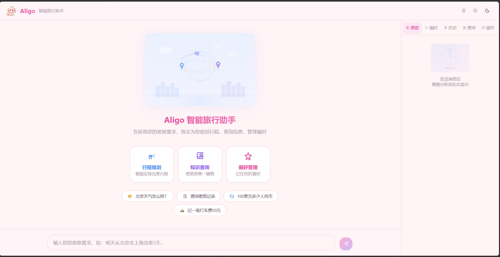
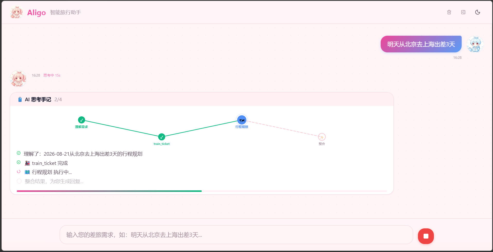
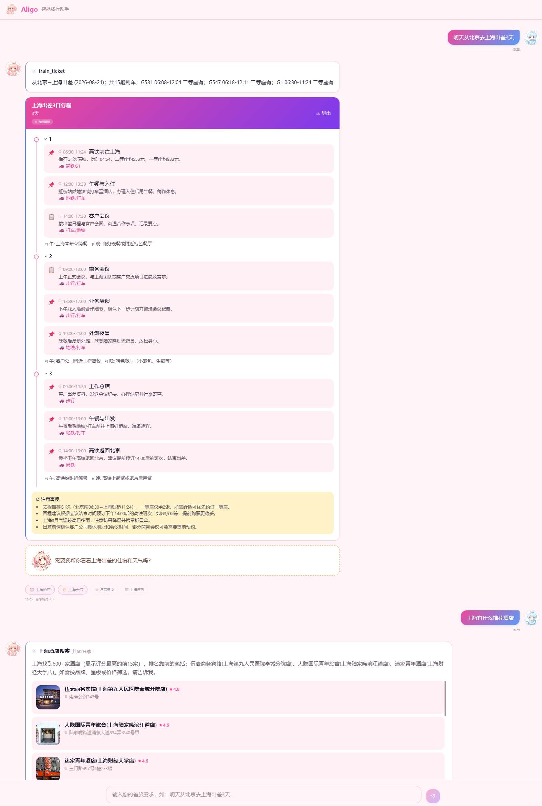

# Aligo 智能旅行助手



基于**大语言模型**（GLM-5.2 / DeepSeek，OpenAI 兼容）和**AgentScope框架**的多智能体旅行规划系统，采用Plan-and-Execute架构，实现智能意图识别、两层记忆系统、RAG知识库、联网搜索和优先级并行调度。提供CLI终端和Web前端两种交互方式。

## ✨ 核心亮点

### 🎯 智能意图识别



- 基于LLM语义理解的多意图识别（准确率90%+，对比关键词匹配提升25%）
- 支持6大类意图：行程规划、记忆查询、偏好管理、知识问答、信息查询、事项收集
- 自然语言理解，无需关键词匹配

### 🧠 两层记忆架构

- **短期记忆**：内存滑动窗口（10轮对话，会话级隔离）
- **长期记忆**：JSON文件持久化 + LLM异步总结
- 智能识别偏好追加/覆盖动作（"我还喜欢如家" vs "我搬家到上海了"）
- 跨会话持久化，支持用户偏好、行程历史、聊天记录、费用记录

### 📚 RAG知识库

- Milvus Lite向量数据库 + BGE-small-zh-v1.5 Embedding模型（本地部署）
- 智能分块（Chunking）+ 滑动窗口切分 + 余弦相似度检索
- 知识溯源：返回文档来源，准确率95%

### ⚡ 优先级并行调度

- Plan-and-Execute架构：IntentionAgent → OrchestrationAgent → 子Agent
- 同优先级Agent并行执行（asyncio.gather）
- 系统响应时间从30秒优化到15秒（-50%）

### 🏗️ 插件化架构

- **Skill Plugins**：所有子Agent重构为独立插件（`skills/`）
- **LazyAgentRegistry**：动态发现机制，自动扫描注册
- **懒加载**：未使用的Skill不加载，启动速度3秒
- **Progressive Disclosure**：渐进式暴露，意图识别阶段仅加载元数据

### 🛡️ 稳定性保障

- **熔断器**：连续失败后自动熔断，保护服务
- **指数退避重试**：自动重试失败请求（最大3次）
- **健康检查**：实时监控LLM服务可用性
  
  

---

## 系统架构

```
用户输入
   ↓
┌──────────────────────────────────────────────────────────┐
│  IntentionAgent (意图识别智能体)                          │
│  - 语义理解用户意图（不使用关键词匹配）                    │
│  - 识别关键实体                                           │
│  - 生成调度计划                                           │
│  - 确定智能体优先级                                       │
│  - 动态加载 Skills Metadata (Progressive Disclosure)     │
└──────────────────────────────────────────────────────────┘
   ↓
┌──────────────────────────────────────────────────────────┐
│  OrchestrationAgent (协调器智能体)                       │
│  - 按优先级调度子智能体                                   │
│  - 同优先级并行执行                                       │
│  - 管理智能体间消息传递                                   │
│  - 集成两层记忆系统                                       │
│  - 动态实例化 Skills (Plugin Architecture)               │
└──────────────────────────────────────────────────────────┘
   ↓
┌─────────────────────── 优先级 1 (并行执行) ──────────────┐
│                                                           │
│  ┌─────────────────────┐  ┌──────────────────────────┐  │
│  │ MemoryQuery Skill   │  │ EventCollection Skill    │  │
│  │ 记忆查询智能体       │  │ 事项收集智能体            │  │
│  │ - 查询旅行记录      │  │ - 出发地/目的地           │  │
│  │ - 查询用户偏好      │  │ - 出行时间/返程地         │  │
│  │ - 查询历史对话      │  │ - 出行目的                │  │
│  └─────────────────────┘  └──────────────────────────┘  │
│                                                           │
│  ┌─────────────────────┐  ┌──────────────────────────┐  │
│  │ Preference Skill    │  │ InformationQuery Skill   │  │
│  │ 偏好管理智能体       │  │ 信息查询智能体            │  │
│  │ - 酒店/航空偏好     │  │ - 网络搜索 (DuckDuckGo)  │  │
│  │ - 座位/房型偏好     │  │ - 实时信息查询           │  │
│  │ - 机型/餐饮偏好     │  │ - LLM摘要生成            │  │
│  │ - 支持追加/覆盖     │  │                          │  │
│  └─────────────────────┘  └──────────────────────────┘  │
│                                                           │
│  ┌─────────────────────────────────────────────────────┐ │
│  │ RAGKnowledgeAgent Skill (知识库查询智能体)          │ │
│  │ - 差旅政策文档查询 (Milvus Lite + RAG)             │ │
│  │ - 企业内部知识检索                                  │ │
│  │ - 自动文档切分 (Chunking) + 向量检索                │ │
│  └─────────────────────────────────────────────────────┘ │
│                                                           │
└───────────────────────────────────────────────────────────┘
   ↓
┌─────────────────────── 优先级 2 (依赖优先级1) ───────────┐
│                                                           │
│  ┌─────────────────────────────────────────────────────┐ │
│  │ ItineraryPlanningAgent Skill (行程规划智能体)       │ │
│  │ - 整合所有前序智能体信息                            │ │
│  │ - 生成完整行程计划                                  │ │
│  │ - 包含：景点、交通、酒店、餐饮                      │ │
│  └─────────────────────────────────────────────────────┘ │
│                                                           │
└───────────────────────────────────────────────────────────┘
   ↓
┌──────────────────────────────────────────────────────────┐
│  结果聚合与记忆更新                                       │
│  - 聚合所有智能体结果                                     │
│  - 更新长期记忆（偏好、行程历史、聊天记录）                │
│  - 生成人性化回复                                         │
└──────────────────────────────────────────────────────────┘
   ↓
最终结果
   ↓
用户看到结果
```

### 连接与可用性

为保证 LLM 服务不稳定时的可用性，在调用链外增加了以下机制（不改变原有业务逻辑）：

| 机制        | 说明                                                                                      |
| --------- | --------------------------------------------------------------------------------------- |
| **熔断器**   | 连续失败若干次后暂停调用 LLM，直接提示「服务暂时不可用」；一段时间后自动半开试探恢复。                                           |
| **重试与退避** | 对意图识别、编排两次 LLM 调用做有限次重试，仅对超时、429、5xx 等可重试错误生效，采用指数退避。                                   |
| **健康检查**  | 会话内输入 `health` 可查看熔断状态并探测 LLM 是否可达；命令行执行 `python cli.py health` 可单独做一次探测（退出码 0/1，便于监控）。 |

配置见 `config.py` 中的 `RESILIENCE_CONFIG`（重试次数、熔断阈值、恢复时间等）。

---

## 📊 关键指标

| 指标        | 优化前 | 优化后  | 提升幅度  |
| --------- | --- | ---- | ----- |
| 意图识别准确率   | 65% | 90%+ | +25%  |
| 知识库问答准确率  | -   | 95%  | 新增功能  |
| 用户偏好记忆准确率 | -   | 95%  | 新增功能  |
| 系统响应时间    | 30秒 | 15秒  | -50%  |
| 用户偏好缓存命中率 | -   | 85%  | 新增功能  |
| 系统启动速度    | 未优化 | 3秒   | 懒加载优化 |

**优化路径**：

1. **V1.0**: 关键词匹配意图识别（准确率65%） + 串行调度（响应时间30秒）
2. **V2.0**: 两层记忆系统 + RAG知识库 + 联网搜索
3. **V3.0**: LLM语义理解意图识别（准确率90%+） + 优先级并行调度（响应时间15秒）
4. **V4.0**: Skill Plugins插件化架构 + LazyAgentRegistry + Redis缓存层

---

## 核心功能

### 1. 意图识别（基于LLM语义理解）

系统支持**6大类意图**自动识别（准确率90%+）：

- ✅ **itinerary_planning**: 规划未来行程
  - 示例："我想3月11日从北京去杭州出差一周"
- ✅ **memory_query**: 查询历史记忆
  - 示例："我去过哪里？"、"我之前说过什么偏好？"
- ✅ **preference**: 管理用户偏好（支持追加/覆盖）
  - 示例："我喜欢住汉庭酒店"、"我还喜欢如家"、"我搬家到上海了"
- ✅ **rag_knowledge**: 查询企业差旅知识库
  - 示例："差旅标准是什么？"、"报销政策是什么？"
- ✅ **information_query**: 联网查询实时信息
  - 示例："杭州明天天气怎么样？"、"北京明天限行吗？"
- ✅ **event_collection**: 收集行程要素
  - 自动提取：出发地、目的地、出发时间、返程时间、出行目的

**意图识别示例**：

```
用户: "我过去都去哪旅游过？"
→ IntentionAgent 识别为 memory_query
→ 调度 MemoryQueryAgent
→ 从 trip_history 查询并回答

用户: "我还喜欢7天酒店"
→ IntentionAgent 识别为 preference
→ 调度 PreferenceAgent
→ LLM 识别「还」字，判断为 append 模式
→ 追加到 hotel_brands 列表
```

### 2. 两层记忆系统

**短期记忆（会话级）**

- 基于**内存**的滑动窗口机制
- 保存最近10轮对话（20条消息）
- 会话级隔离，不持久化
- 用于上下文理解和快速访问

**长期记忆（持久化）**

- 💾 **JSON文件持久化存储**（`data/memory/{user_id}.json`）：用户偏好、历史行程、完整聊天历史、费用记录
- 🎯 **用户偏好管理**：支持动态添加任意偏好类型，智能识别追加/覆盖动作
- 📅 **历史行程记录**：出发地、目的地、时间、目的，支持跨会话查询
- 📊 **统计信息**：常去目的地、总行程数
- 🤖 **LLM异步总结**：自动总结历史会话和行程记录
- ⚡ **写回缓存**：内存缓存 + atexit自动刷盘

**测试记忆系统**：

```bash
pytest tests/test_memory_system.py
```

测试覆盖：

- ✅ 短期记忆：添加、查询、统计
- ✅ 长期记忆-偏好：动态添加、跨会话访问
- ✅ 长期记忆-行程：保存、查询、高频目的地统计
- ✅ 长期记忆-聊天历史：持久化对话记录
- ✅ LLM总结：异步生成历史摘要（包含行程记录）
- ✅ 跨会话持久化：新会话访问旧数据

### 3. RAG 知识库

基于 **Milvus Lite** 和 **BGE-small-zh-v1.5 Embedding模型**的企业差旅知识检索系统。

**技术方案**：

- **向量数据库**: Milvus（本地存储）
- **Embedding模型**: BGE-small-zh-v1.5（中文向量化，首次运行自动从 HuggingFace 下载）
- **文档处理**: 智能分块（Chunking）+ 滑动窗口切分
- **检索算法**: 余弦相似度检索（Top-K=3）
- **可追溯性**: 返回文档来源，支持知识溯源
- **准确率**: 95%（知识库问答准确率）

**初始化知识库**：

```bash
python skills/ask-question/script/init_knowledge_base.py
```

**知识库内容**（8类文档）：

- 差旅标准和规定
- 报销政策
- 预订指南
- 常见问题FAQ
- 紧急情况处理
- 平台使用指南
- 城市差旅指南
- 环保倡议

### 4. 信息查询（联网搜索）

基于 **DuckDuckGo (DDGS)** 的免费网络搜索功能：

- 🌐 实时网络搜索（天气、景点、实时新闻）
- 📝 LLM自动摘要（提取关键信息）
- 🔗 来源追踪（返回搜索来源）
- 🚀 异步查询（提升响应速度）

### 5. 优先级并行调度

基于 **asyncio.gather** 的智能并行调度机制：

- 📋 **多意图识别**：支持6大类意图（规划行程、查询记忆、管理偏好、知识问答、信息查询、实时检索）
- ⚡ **优先级+并行混合模式**：同优先级Agent并行执行，不同优先级串行依赖
- 🎯 **动态调度**：根据意图识别结果动态分配优先级
- 📈 **性能提升**：系统响应时间从30秒优化到15秒（-50%）

---

## 快速开始

### 1. 安装依赖

```bash
# 使用 requirements.txt 安装所有依赖
pip install -r requirements.txt

# 或者手动安装核心依赖
pip install "setuptools>=69.0.0,<82"  # milvus_lite 依赖
pip install agentscope==1.0.16        # 多智能体框架
pip install "pymilvus[milvus_lite]==2.6.9"  # 向量数据库
pip install sentence-transformers==5.2.3    # Embedding模型
pip install rich==13.9.4                    # CLI界面
pip install ddgs==9.10.0                    # 网络搜索
```

### 2. 配置模型与密钥

复制 `.env.example` 为 `.env`，填入 API 密钥：

```bash
cp .env.example .env
```

**必填密钥**（与 `ALIGO_BASE_URL` 对应的模型服务商）：

```env
ALIGO_API_KEY=your-api-key-here
```

**完整环境变量说明**：

| 变量 | 必填 | 默认值 | 说明 |
| --- | --- | --- | --- |
| `ALIGO_API_KEY` | ✅ | - | LLM API 密钥（OpenAI 兼容接口） |
| `ALIGO_MODEL_NAME` | | `glm-5.2-fast-preview` | 模型名称 |
| `ALIGO_BASE_URL` | | 阿里云 MAAS（见 `.env.example`） | OpenAI 兼容 API 地址 |
| `AMAP_API_KEY` | | - | 高德天气 Key（不填则天气降级为网络搜索） |
| `ALIGO_EMBEDDING_MODEL` | | `BAAI/bge-small-zh-v1.5` | RAG 向量模型 |
| `ALIGO_DATABASE_URL` | | - | PostgreSQL 连接串（不填则 JSON 文件持久化） |
| `ALIGO_REDIS_URL` | | - | Redis 连接串（不填则进程内缓存） |
| `ALIGO_CACHE_TTL` | | `3600` | 缓存 TTL（秒） |
| `CORS_ORIGINS` | | - | 允许的跨域来源（逗号分隔，生产环境配置） |
| `HF_ENDPOINT` / `HF_HUB_OFFLINE` | | - | HuggingFace 镜像，国内加速模型下载 |

**切换模型**（GLM-5.2 ↔ DeepSeek，均 OpenAI 兼容）：

```env
# GLM-5.2 Fast Preview（阿里云 MAAS）
ALIGO_MODEL_NAME=glm-5.2-fast-preview
ALIGO_BASE_URL=https://ws-qvg9u4gn3ewyjs3t.cn-beijing.maas.aliyuncs.com/compatible-mode/v1

# 或 DeepSeek
ALIGO_MODEL_NAME=deepseek-chat
ALIGO_BASE_URL=https://api.deepseek.com/v1
```

**前端智能追问（可选）**：在 `web/.env` 中配置（参考 `web/.env.example`，不配置则该功能自动降级）：

```env
VITE_LLM_API_URL=https://api.deepseek.com/v1/chat/completions
VITE_LLM_API_KEY=your-api-key-here
VITE_LLM_MODEL=deepseek-chat
```

也可直接编辑 `config.py` 中的 `LLM_CONFIG`。

### 3. 初始化知识库

```bash
python skills/ask-question/script/init_knowledge_base.py
```

### 4. 启动系统

**CLI模式**：

```bash
python cli.py
```

**Web模式**（FastAPI + React）：

```bash
# 启动后端
cd server && uvicorn app:app --reload --port 8000

# 启动前端（另一个终端）
cd web && npm install && npm run dev
```

访问 http://localhost:5173 即可使用Web界面。

---

## 子智能体详解 (Skills)

所有子智能体已重构为 **Skill Plugins**，位于 `skills/` 目录下，支持动态发现与加载。

### 1. MemoryQueryAgent (记忆查询智能体)

- **职责**: 查询用户的历史记忆
- **查询内容**:
  - 旅行历史（trip_history）
  - 用户偏好（preferences）
  - 历史对话摘要（chat_history）
- **特点**:
  - 直接查询本地记忆，无需联网
  - 使用 LLM 生成自然语言回答
  - 支持复杂的记忆推理
- **示例**: "我过去去过哪些地方？"、"我上次去北京是什么时候？"

### 2. EventCollectionAgent (事项收集智能体)

- **职责**: 收集行程规划的核心信息
- **收集内容**: 出发地、目的地、出发时间、返程时间、出行目的
- **特点**: 主动推断缺失信息

### 3. PreferenceAgent (偏好管理智能体)

- **职责**: 识别和管理用户所有偏好
- **管理偏好**:
  - 酒店品牌、航空公司、座位偏好、房型偏好
  - 机型偏好、餐饮偏好、交通偏好、预算等级
  - 支持任意自定义偏好类型
- **智能模式**:
  - **追加模式**：识别「还」、「也」等关键词，追加到现有偏好
  - **覆盖模式**：识别「搬家到」、「改成」等关键词，替换旧偏好
  - **示例**: "我还喜欢汉庭" → 追加；"我搬家到上海" → 覆盖
- **特点**:
  - 感知当前已有偏好，避免重复
  - 所有偏好作为长期偏好持久化保存
  - 从对话中提取隐含偏好

### 4. InformationQueryAgent (信息查询智能体)

- **职责**: 实时信息检索（联网）
- **查询能力**: DuckDuckGo 搜索 + LLM 摘要
- **查询场景**: 天气、景点、实时新闻、通用问答

### 5. ItineraryPlanningAgent (行程规划智能体)

- **职责**: 生成完整行程计划
- **规划内容**: 每日时间表、住宿建议、餐饮建议、交通路线、注意事项
- **特点**: 即使信息不完整也给出合理建议

### 6. RAGKnowledgeAgent (知识库查询智能体)

- **职责**: 查询企业商旅知识库
- **技术栈**: Milvus Lite + BGE-small-zh-v1.5 中文向量模型
- **特点**: 提供文档溯源，返回参考来源

### 7. ExpenseTrackerAgent (费用记录智能体)

- **职责**: 记录、查询、汇总差旅费用
- **能力**: 自然语言解析费用（"打车费50元"）、分类推断、按时间汇总
- **存储**: 写入长期记忆的 expenses 字段
- **示例**: "记一笔打车费50元"、"这次出差花了多少钱"

### 8. CurrencyConverterAgent (汇率换算智能体)

- **职责**: 实时汇率查询与货币换算
- **数据源**: frankfurter.app API（免费）
- **支持货币**: CNY、USD、EUR、JPY、GBP、KRW、SGD等12种
- **示例**: "100美元多少人民币"、"日元汇率"

### 9. TranslationAgent (翻译智能体)

- **职责**: 多语言翻译
- **数据源**: MyMemory API（免费）
- **支持语言**: 中英日韩法德西等11+种语言
- **示例**: "翻译成英文"、"用日语怎么说你好"

### 10. VisaInfoAgent (签证信息智能体)

- **职责**: 查询各国签证政策和入境要求
- **技术栈**: RAG检索 + 签证知识文档
- **示例**: "去日本需要签证吗"、"泰国签证怎么办"

---

## CLI 使用指南

### 启动

```bash
python cli.py
```

**启动速度**: 约 3 秒（采用LazyAgentRegistry懒加载技术）

### 内置命令

| 命令            | 说明                    |
| ------------- | --------------------- |
| `help`        | 显示帮助信息                |
| `status`      | 查看当前状态和记忆             |
| `health`      | 检查 LLM 服务是否可用并显示熔断器状态 |
| `clear`       | 清空当前任务（保留长期记忆）        |
| `history`     | 查看历史行程                |
| `preferences` | 查看用户偏好                |
| `exit`        | 退出程序                  |

单独做健康检查（不进入交互）：`python cli.py health`，返回 `OK` / `FAIL: ...`，退出码 0/1。

---

## 测试

### 运行全部测试

```bash
pytest
```

### 集成测试 (QA)

完整跑通所有意图和子智能体的端到端测试：

```bash
python tests/test_cli_qa.py
```

### 单元测试

针对各个核心模块的测试：

```bash
pytest tests/test_memory_system.py        # 记忆系统
pytest tests/test_intention_agent.py      # 意图识别
pytest tests/test_orchestration.py        # 协调系统
pytest tests/test_rag_agent.py            # RAG知识库
pytest tests/test_circuit_breaker.py      # 熔断器
pytest tests/test_json_parser.py          # JSON解析
```

---

## 项目结构

```
差旅出行助手/
├── agents/                          # 核心编排层
│   ├── intention_agent.py           # 意图识别（语义理解）
│   ├── orchestration_agent.py       # 协调器（并行调度）
│   └── lazy_agent_registry.py       # 智能体插件注册器（懒加载）
├── skills/                          # Skill Plugins (子智能体)
│   ├── ask-question/                # 知识库问答 Skill (RAG)
│   ├── event-collection/            # 事项收集 Skill
│   ├── plan-trip/                   # 行程规划 Skill
│   ├── preference/                  # 偏好管理 Skill
│   ├── query-info/                  # 信息查询 Skill (天气/搜索)
│   ├── memory-query/                # 记忆查询 Skill
│   ├── expense-tracker/             # 费用记录 Skill
│   ├── currency-converter/          # 汇率换算 Skill
│   ├── hotel-search/                # 酒店搜索 Skill
│   ├── translation/                 # 翻译 Skill
│   └── visa-info/                   # 签证信息 Skill
├── context/                         # 记忆系统
│   ├── memory_manager.py            # 记忆管理器
│   ├── short_term_memory.py         # 短期记忆（内存滑动窗口）
│   └── long_term_memory.py          # 长期记忆（JSON持久化）
├── server/                          # FastAPI 后端
│   ├── app.py                       # FastAPI 应用（CORS、静态文件）
│   ├── session.py                   # 会话管理器（LRU缓存）
│   ├── models.py                    # Pydantic 请求模型
│   └── routes/
│       ├── chat.py                  # SSE 流式聊天接口
│       └── memory.py                # 记忆/历史/偏好/插件 API
├── web/                             # React 前端
│   ├── src/
│   │   ├── components/              # Chat、Results、Sidebar 等组件
│   │   ├── api/                     # SSE 客户端 + REST 接口
│   │   ├── store/                   # Zustand 状态管理
│   │   └── styles/                  # CSS 主题变量
│   └── package.json                 # React 19, Tailwind 4, Vite 8
├── data/
│   ├── memory/                      # 长期记忆JSON存储（user_id.json）
│   ├── models/                      # 模型缓存（首次运行自动下载，已在 .gitignore）
│   └── plugin_config.json           # 插件启用/禁用配置
├── tests/                           # 测试脚本
│   ├── test_cli_qa.py               # 端到端集成测试
│   ├── test_memory_system.py        # 记忆系统测试
│   ├── test_intention_agent.py      # 意图识别测试
│   ├── test_orchestration.py        # 协调系统测试
│   ├── test_rag_agent.py            # RAG知识库测试
│   ├── test_information_query_agent.py # 信息查询测试
│   ├── test_event_collection_agent.py  # 事项收集测试
│   ├── test_circuit_breaker.py      # 熔断器测试
│   ├── test_json_parser.py          # JSON解析测试
│   ├── test_llm_response.py         # LLM响应提取测试
│   └── test_plugin_config.py        # 插件配置测试
├── utils/                           # 工具与连接可用性
│   ├── circuit_breaker.py           # 熔断器
│   ├── llm_resilience.py            # 重试退避、健康检查
│   ├── json_parser.py               # JSON 解析（6种降级策略）
│   ├── llm_response.py              # LLM 响应提取
│   └── skill_loader.py              # Skill 加载器
├── cli.py                           # CLI 主程序（Rich终端UI）
├── config.py                        # 配置文件
├── config_agentscope.py             # AgentScope 初始化与模型配置
├── .env.example                     # 环境变量模板
└── README.md                        # 本文件
```

---

## 技术栈总览

### 核心框架

- 📦 **AgentScope 1.0.16** - 多智能体框架
- 🤖 **GLM-5.2 / DeepSeek（OpenAI 兼容）** - 大语言模型

### 数据存储

- 💾 **JSON文件** - 长期记忆持久化（用户偏好、历史行程、聊天记录、费用）
- 🔍 **Milvus Lite** - 向量数据库（本地.db文件，RAG知识库）

### 向量化与检索

- 🧠 **BGE-small-zh-v1.5** - 中文Embedding模型（本地部署）
- 📚 **Sentence-Transformers 5.2.3** - 向量化工具库
- 🎯 **余弦相似度检索** - Top-K=3检索算法

### 联网与搜索

- 🌐 **DuckDuckGo (DDGS 9.10.0)** - 免费网络搜索引擎
- 🌤️ **wttr.in** - 免费天气查询API
- 💱 **frankfurter.app** - 免费汇率查询API
- 🌍 **MyMemory API** - 免费翻译API
- 📝 **LLM自动摘要** - 搜索结果智能提取

### Web服务

- 🚀 **FastAPI** - 异步Web框架（REST + SSE流式接口）
- ⚛️ **React 19 + TypeScript** - 前端框架
- 🎨 **Tailwind CSS 4** - 样式框架
- 📦 **Zustand 5** - 状态管理
- 🔧 **Vite 8** - 前端构建工具
- 📡 **SSE (Server-Sent Events)** - 实时流式响应

### 架构设计

- 🏗️ **Skill Plugins插件化架构** - 12个独立Skill插件
- 🔄 **LazyAgentRegistry动态发现** - 自动扫描注册Agent插件
- ⚡ **懒加载机制** - 未使用的Skill不加载（启动速度3秒）
- 🔀 **Progressive Disclosure渐进式暴露** - 意图识别阶段仅加载元数据，执行阶段按需加载
- 🎯 **优先级+并行混合调度** - asyncio.gather并发执行

### 稳定性保障

- 🔁 **指数退避重试** - 自动重试失败请求（最大2次）
- 🩺 **熔断器机制** - 连续失败5次后暂停调用，60秒后自动恢复
- 💊 **健康检查** - 实时监控LLM服务可用性
- 🛡️ **健壮JSON解析** - 6种降级策略处理LLM输出异常

### 用户界面

- 🖥️ **Rich 13.9.4** - 精美的CLI终端界面
- 🌐 **React Web界面** - 暗色/亮色主题、SSE实时流式展示

---

## ⚠️ 注意事项

### 模型配置

- 必须配置 LLM API 密钥（通过 `.env` 文件或 `config.py`）
- BGE Embedding模型首次运行时自动从 HuggingFace 下载（约 90MB），缓存到 `data/models/`

### 数据存储

- 当前版本使用**JSON文件存储**长期记忆（`data/memory/{user_id}.json`）
- 如需切换到数据库存储，需修改 `context/long_term_memory.py` 和 `context/short_term_memory.py`

### 知识库初始化

- 首次运行前必须初始化RAG知识库
- 知识库文档位于 `skills/ask-question/data/documents/`
- Milvus数据库文件生成在 `skills/ask-question/data/milvus_travel_kb.db`

### Web模式

- 后端默认运行在 `localhost:8000`，前端默认运行在 `localhost:5173`
- Vite开发模式下自动代理 `/api` 请求到后端
- 生产模式：先 `cd web && npm run build`，然后启动后端即可访问 `http://localhost:8000`

### 性能优化

- 懒加载机制：系统启动时仅扫描Skill元数据，首次调用时才加载
- 并行调度：同优先级Agent并发执行，提升响应速度
- 写回缓存：长期记忆使用内存缓存，atexit时自动刷盘

---

## 🚀 未来规划

- [ ] 支持更多LLM模型（OpenAI、Claude等）
- [ ] 更多Skill插件（酒店预订、机票查询等）
- [ ] 数据库持久化存储（PostgreSQL/MySQL）
- [ ] 监控和日志系统
- [ ] CI/CD 自动化测试与部署

---

## 许可证

MIT License
