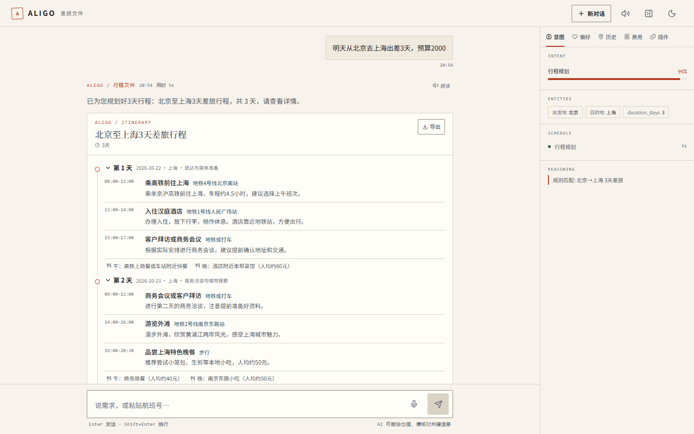
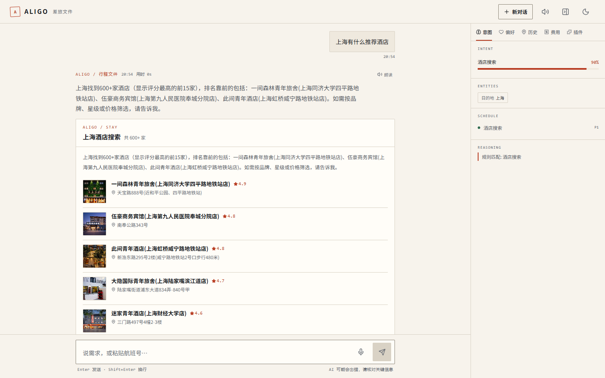
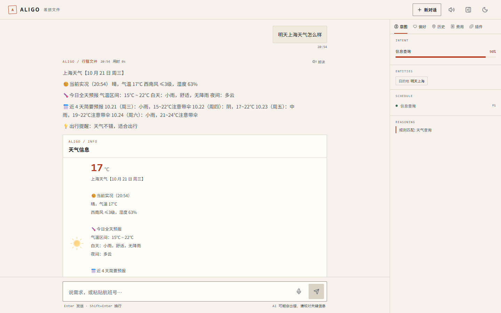
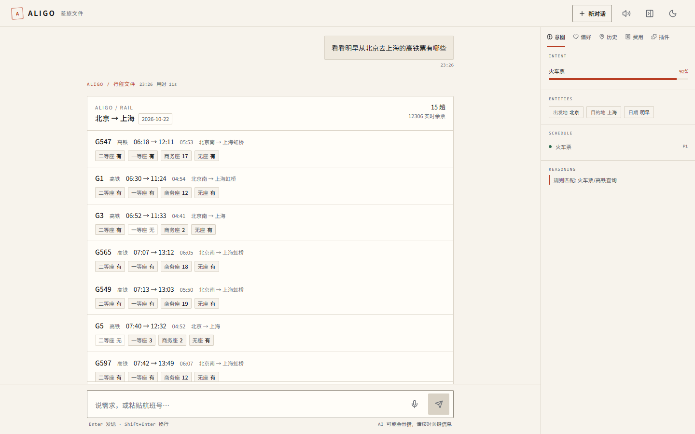
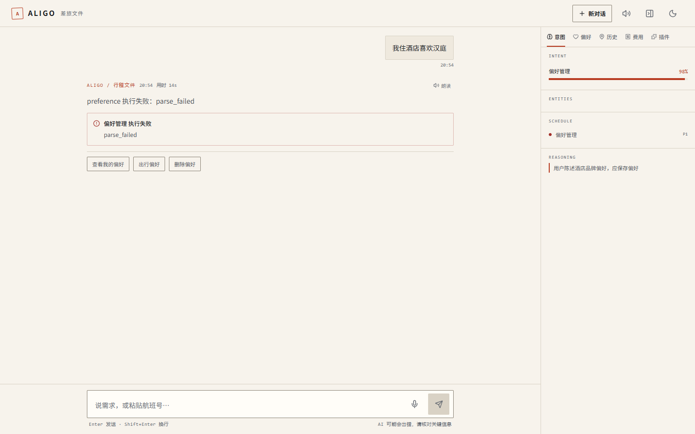
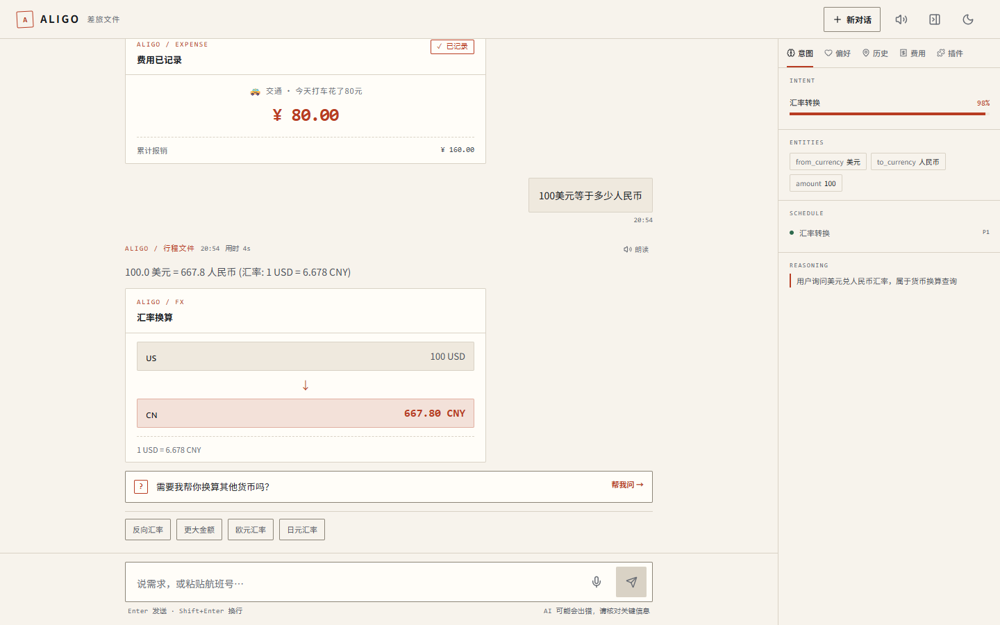

# Aligo · 智能差旅助手

> 一句中文需求 → 一份能直接照着走的行程，顺带把酒店、车票、天气、记账、汇率、翻译一起办了。

基于 **AgentScope 多智能体框架 + FastAPI + React 19** 的差旅规划系统：意图识别 → 优先级并行调度 → 10 个技能智能体 → 两层记忆 → SSE 流式回显。
模型层做了**多通道路由与故障转移**，单个模型服务挂掉不会让整站瘫痪。

🔗 **在线展示页**：<https://lc-di-yan.github.io/Lincan-Travel-Assistant-Agent/>（含完整截图、能力矩阵与架构说明）


<p>


</p>

---

## 效果预览

| 行程规划（一句话 → 3 天可执行行程，约 5s） | 酒店搜索（高德 POI + 图片/评分/地址） |
|---|---|
|  |  |

| 天气 / 信息查询 | 火车票（12306） |
|---|---|
|  |  |

| 偏好记忆（说一次就记住，下次规划自动用上） | 记账 + 汇率（一句话完成，侧栏实时汇总） |
|---|---|
|  |  |

> 想看完整交互？[`docs/showcase.html`](docs/showcase.html) 是一个可离线打开的产品展示页（含全部截图、能力矩阵与架构说明）。

---

## 它解决了什么

普通「一个 prompt 直出」的旅行助手，遇到这几件事就会崩：多轮追问丢上下文、查完酒店又问天气就串台、模型一挂全站 500、行程和记账对不上。Aligo 的做法是把它们拆开：

1. **先判意图，再调度**：规则快路由命中「A 到 B + N 天」直接出意图（0ms），复杂表达才走 LLM，避免每次都等模型。
2. **按优先级并行**：查车票与排行程可同时进行，结果按优先级聚合，而不是串行硬等。
3. **两层记忆**：短期 10 轮（追问「那住哪儿」能接上）+ 长期 JSON/PG（偏好、历史行程、费用）。
4. **模型层容灾**：主通道 → 备用通道 → 第三通道，401/403/404/408/429/5xx/超时自动切换，整链还有总超时预算。
5. **失败也不骗人**：上游报错只进日志，用户看到的是人话；规划失败不会写进你的历史行程。

---

## 能力矩阵

| 能力 | 说明 | 典型耗时 |
|---|---|---|
| 行程规划 | 多日/单日、预算、偏好、车次建议、每日活动与餐饮 | 5–6 s |
| 酒店 / 餐厅 / 景点 | 高德 POI，按评分排序，带图片、地址、均价 | 0.3–0.5 s |
| 天气与联网查询 | 高德天气，失败降级联网搜索 | 0.3 s |
| 火车票 | 12306 车次、时刻、席别与票价 | 0.8–1.1 s |
| 偏好管理 | 酒店品牌、航司、座位、家庭住址，追加/覆盖 | 2.8–3.9 s |
| 记忆查询 | 「我之前说过什么」「上次去上海住哪」 | 5.6–6.0 s |
| 费用记账 | 一句话记账，分类/币种/日期，侧栏汇总 | <0.1 s |
| 汇率换算 | 实时汇率，多币种 | 3.7–4.4 s |
| 翻译 | 中英日韩等，术语保持 | 2.4–3.8 s |
| 知识库问答 | 差旅标准/报销政策 RAG（Milvus Lite + bge-small-zh） | 4.4–7.5 s |

还有两个容易被忽略的细节：

- **多轮追问**：缺出发地时反问「从哪个城市出发？」，用户答「北京」会合并回原需求；如果用户换话题（「上海有什么推荐酒店」），会正确丢弃追问、按新意图处理。
- **并发安全**：同一会话的请求串行执行，避免共享的调度队列互相覆盖（不同用户互不影响）。

---

## 架构

```text
用户 ──HTTP/SSE──▶ FastAPI  /api/chat
                     │
                     ├─ IntentionAgent ── 规则快路由(0ms) ─┐
                     │                   └─ LLM 识别(~2s) ─┤
                     │                                     ▼
                     ├─ OrchestrationAgent ── 按优先级并行调度
                     │        ├─ plan-trip           行程规划
                     │        ├─ place-search        酒店 / 餐厅 / 景点
                     │        ├─ query-info          天气 / 联网搜索
                     │        ├─ train-ticket        12306
                     │        ├─ preference          偏好
                     │        ├─ memory-query        记忆
                     │        ├─ expense-tracker     记账
                     │        ├─ currency-converter  汇率
                     │        ├─ translation         翻译
                     │        └─ ask-question        知识库 RAG
                     │
                     ├─ MemoryManager ── 短期(10 轮) + 长期(JSON / PostgreSQL)
                     ├─ FailoverChatModel ── 主 / 备 / 兜底通道 + 总超时预算
                     └─ 存储：JSON/SQLite · Milvus Lite · Redis(可选)
```

**技术栈**：Python 3.12 · FastAPI · AgentScope 1.0.16 · Sentence-Transformers · Milvus Lite · React 19 + Vite + TypeScript + Zustand + Tailwind。

目录速览：

```text
agents/          意图识别、编排、懒加载注册表
context/         短期/长期记忆、会话焦点状态
.claude/skills/  10 个技能智能体（每个含 SKILL.md + script/agent.py）
server/          FastAPI 应用、路由、会话管理
utils/           通道故障转移、错误分类、JSON 兜底解析、熔断
web/             React 前端（SSE 客户端、卡片组件）
tools/           测试与运维脚本（e2e 矩阵、截图、密钥扫描）
tests/           81 条 pytest 用例
docs/            设计文档、截图、展示页、变更记录
```

---

## 快速开始

**环境**：Python 3.12、Node 18+；可选 PostgreSQL / Redis（不配则自动回退 JSON 文件与进程内缓存）。

```bash
# 1. 依赖
python -m venv .venv && .venv\Scripts\activate      # Windows
pip install -r requirements.txt

# 2. 配置模型（见下一节「配置与密钥」）
copy .env.example .env
# 编辑 .env：填 ALIGO_API_KEY / ALIGO_BASE_URL / ALIGO_MODEL_NAME

# 3. 前端构建（web/dist 不进仓库，需要自己 build）
cd web && npm install && npm run build && cd ..

# 4. 启动（后端 + 前端同一端口）
python -m uvicorn server.app:app --host 0.0.0.0 --port 3003
# 打开 http://127.0.0.1:3003
```

Windows 下也可以用现成脚本：`.\start-demo.ps1` 启动、`.\stop-demo.ps1` 停止。

**知识库（可选）**：首次使用 RAG 问答需要构建向量库

```bash
python .claude/skills/ask-question/script/init_knowledge_base.py
```

首次加载 embedding 模型会从 HuggingFace 下载约 90MB；国内可在 `.env` 里配 `HF_ENDPOINT=https://hf-mirror.com`。

---

## 配置与密钥

所有配置来自 `.env`（**不进仓库**）。复制 `.env.example` 后填写：

| 变量 | 必填 | 说明 |
|---|---|---|
| `ALIGO_API_KEY` | ✅ | OpenAI 兼容接口的 key |
| `ALIGO_BASE_URL` | ✅ | 例如 `https://api.example.com/v1` |
| `ALIGO_MODEL_NAME` | ✅ | 例如 `DeepSeek-V4.1-Flash-1017` |
| `ALIGO_FALLBACK_BASE_URLS` | 建议 | 备用通道，逗号分隔 |
| `ALIGO_FALLBACK_MODEL_NAMES` | 建议 | 与上一行按位置对应 |
| `ALIGO_FALLBACK_API_KEYS` | 可选 | 缺省沿用主 key |
| `ALIGO_LLM_TOTAL_TIMEOUT` | 可选 | 整条通道链总预算，默认 110s |
| `AMAP_API_KEY` | 可选 | 高德天气；不填则降级联网搜索 |
| `ALIGO_DATABASE_URL` | 可选 | PostgreSQL，不填用 JSON 文件 |
| `ALIGO_REDIS_URL` | 可选 | Redis，不填用进程内缓存 |

### 密钥怎么保管

- `.env`、`.env.bak-*`、本地运维脚本（`private/`）都在 `.gitignore` 里，只留在本机；
- 仓库里只提供 `.env.example` 模板，**不含任何真实 key**；
- 提交前可自查：

```bash
python tools/scan_secrets.py     # 扫描 sk- / QC- / token / 口令，输出脱敏
```

- 万一误提交：立即在服务商侧作废并轮换该 key，再用 `git filter-repo` 清理历史。

> 本项目开发期的模型通道曾因账号欠费整体 403，因此代码里做了多通道容灾；
> 换自己的 key 后，`python verify_llm.py` 可一键体检通道是否可用。

---

## 测试

```bash
# 单元 + 集成（建议先停服务：Milvus Lite 数据目录是进程独占锁）
python -m pytest -q                                  # 75 passed / 6 skipped

# 前端-后端契约（需服务运行中）
python -m pytest tests/test_web_contracts.py -q      # 4 passed / 2 skipped（TTS 需 mock 上游）

# 16 条意图矩阵端到端（真实调用模型）
python tools/full_test.py                            # 16/16

# 边界与并发（空消息、超长、emoji、并发、新会话）
python tools/edge_cases.py                           # 7/7

# 模型通道体检
python verify_llm.py
```

测试覆盖：9 大意图路由、多轮追问、记忆/偏好落盘、并发隔离、错误文案不泄漏上游细节、通道故障转移与总超时预算。

---

## 稳定性设计

| 机制 | 行为 |
|---|---|
| 通道故障转移 | 401/402/403/404/408/429/5xx、连接失败、超时 → 切下一条并记住可用通道 |
| 整链超时预算 | 每通道取 `min(单次超时, 剩余预算)`，避免「两个通道各卡 60s」拖到 3 分钟 |
| 启动自检 | 启动时探活一次，日志直接打出「通道可用 / 不可用」，不用等用户踩坑 |
| 熔断 | 连续失败后短暂熔断并半开恢复 |
| JSON 兜底 | 6 级降级解析：直接解析 → 去围栏 → 截取括号 → 修复常见错误 |
| 错误分层 | 技术细节只进日志，用户看到「模型服务账号欠费，结清后才能继续使用」这类人话 |

---

## 文档

- [设计文档与开发指南](docs/DEVELOPER_GUIDE.md)（原 README，含子智能体详解与 CLI 用法）
- [变更记录](docs/CHANGELOG.md)（2026-10 的故障复盘与修复）
- [产品展示页](docs/showcase.html)（可离线打开）
- 其它设计与方案：`docs/` 目录

---

## 已知限制

- 朗读（TTS）依赖额外的 MiMo 上游 key，未配置时相关接口不可用，日程/行程功能不受影响。
- 同一会话内消息串行处理（并发会排队），这是为避免调度队列被覆盖的有意取舍。
- 前端产物 `web/dist` 不入库，克隆后需 `npm run build`。
- 规则快路由只覆盖常见表达，冷门句式会走 LLM，多花 2–3 秒。

---

<p align="center"><sub>Aligo · 差旅文件 —— 把「查、排、记」收进一个对话框</sub></p>
